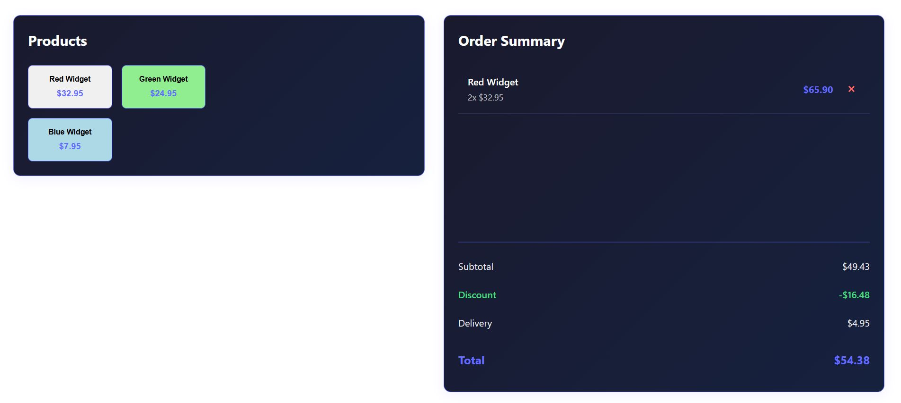

# React + TypeScript + Vite

Install dependencies with `yarn install`
Start with `yarn dev`

## Description

 - The required interface is captured in the useBasket hook (business logic).
 - Extensible: Offers and discounts are modeled as entities, not hardcoded into the logic
 - Added basic responsive design for mobile / desktop

## Considerations / Exclusions for simplicity

 - No styling tools like Prettier or Eslint
 - No routing. Can be improved by using React Router or others.
 - No testing added
 - Simple CSS rules, no use of Tailwind or other UI libraries

 All the points above are improvents to be made on production-ready apps.

## Preview

